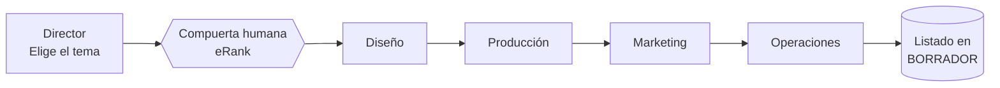

# Los agentes: quién es quién y qué hace cada uno

El sistema tiene **cinco agentes de IA**. Cada uno vive en su propio archivo
dentro de la carpeta `agents/` y tiene un rol acotado. Además hay **dos pasos
que ya no son agentes**: se convirtieron en código con reglas fijas (más abajo
se explica por qué).

## Mapa rápido

| # | Agente | Etapa | En una frase |
|---|---|---|---|
| 1 | **Director** | 1 | Elige la ocasión y el tema de diseño, con la anticipación correcta |
| — | *(Investigación)* | 1 | **Código, no agente:** genera las 20 keywords |
| — | *(Validación)* | 2 | **Código, no agente:** decide si el tema sobrevive |
| 2 | **Diseño** | 2 | Crea el concepto visual y revisa marcas registradas |
| 3 | **Producción** | 2 | Crea el producto en el proveedor y controla el margen |
| 4 | **Marketing** | 2 | Escribe el título, los tags y el precio (SEO de Etsy) |
| 5 | **Operaciones** | 2 | Deja el listado en borrador para aprobación humana |

---

## 1. Director (estrategia)

**Su trabajo:** a partir de un objetivo de negocio ("elegí la mejor oportunidad
estacional ahora"), decide **dos cosas distintas**:

- La **ocasión** (`occasion`): el evento que trae tráfico y que la gente escribe
  en el buscador. Tiene que ser corto, de 1 o 2 palabras (`birthday`,
  `graduation`, `halloween`). Nunca un nombre largo de festividad.
- El **tema de diseño** (`design theme`): la idea que diferencia el diseño en la
  página (ej: "nurse mom" = "mamá enfermera"). Esto va al diseño y a los tags,
  **no** es la palabra de búsqueda.

**Herramientas que usa:** consulta el calendario estacional (`planning_dates`) y
la lista de nichos posibles (`suggest_niches`).

> [!info] Por qué separa "ocasión" y "tema de diseño"
> Es la lección más importante del negocio (SOP v1.1): la gente busca por
> **ocasión** ("regalo de cumpleaños"), no por el cruce creativo. El cruce sirve
> para que TU diseño destaque, pero si lo usás como palabra de búsqueda, nadie
> lo escribe y no aparecés. Ver [[07 - Glosario]] → *cross-niching*.

---

## Los dos pasos que son código, no agentes

Al principio del proyecto, "investigar keywords" y "validar el tema" eran
agentes de IA. Se cambiaron a **código con reglas fijas** porque son decisiones
que tienen que ser siempre iguales y correctas. Hoy:

- **Generar las 20 keywords (Etapa 1):** una regla arma el bloque de 20 palabras
  siguiendo una fórmula fija: **5 cortas + 12 medianas + 3 largas**, combinando
  ejes como edad, rol y hobby. No depende de que la IA "acierte".
- **Validar el tema (Etapa 2):** otra regla toma los datos reales de eRank y
  clasifica cada keyword (sirve / no sirve / trampa) con umbrales medibles, y
  decide si el tema sobrevive. Ver los umbrales en
  [[06 - La salida y cómo leerla]].

> [!tip] Esto es la "regla de oro" en acción
> Ver [[03 - Qué es Strands Agents]] → *la herramienta decide, no la IA*. Estos
> dos pasos son el mejor ejemplo: lo que estaba en manos de la IA pasó a ser
> código fijo, y el sistema se volvió más rápido y confiable.

---

## 2. Diseño

**Su trabajo:** convertir el tema validado en un **concepto visual** concreto,
alineado con la estética de la marca (minimalista, humor sutil).

**Pasos que sigue:**
1. Escribe un brief corto (estilo, elementos, texto del diseño).
2. Revisa que las frases del diseño **no choquen con marcas registradas**
   (`check_trademark`). Crítico en POD: usar una marca ajena es problema legal.
3. Genera el concepto de diseño (`generate_design_concept`).

---

## 3. Producción

**Su trabajo:** convertir el concepto aprobado en un **producto listo en el
proveedor**, cuidando que el costo permita el margen objetivo (40%).

**Pasos que sigue:**
1. Crea el producto POD (`create_pod_product`) con tipo (remera, taza, etc.).
2. Verifica que el costo, frente al precio máximo ($35), deje el margen mínimo.

---

## 4. Marketing (SEO de Etsy)

**Su trabajo:** escribir el texto del listado optimizado para el buscador de
Etsy.

**Qué produce:**
1. Un **título** (menos de 140 caracteres) que incluya las keywords fuertes.
2. **13 tags** relevantes (Etsy permite 13).
3. Una **descripción** corta con la voz de la marca.
4. Un **precio** dentro del tope, respetando el margen.

---

## 5. Operaciones (publicación con freno)

**Su trabajo:** dejar el listado en estado **borrador (DRAFT)** y resumir qué
queda pendiente de aprobación.

**Regla clave:** **no publica de forma definitiva.** Publicar es irreversible y
requiere que una persona apruebe. Ver [[06 - La salida y cómo leerla]].

---

## Cómo se ajusta un agente

Esta es la parte práctica: **cambiar el comportamiento de un agente casi siempre
es editar un texto en español-técnico (inglés), no reprogramar nada.**

Cada agente vive en `agents/<nombre>.py` y tiene una sección de instrucciones
llamada `ROLE`. Está escrita en un formato fijo con estas partes:

| Sección | Qué define | Ejemplo de ajuste |
|---|---|---|
| `ROLE` | Quién es el agente | "Sos el diseñador de producto POD" |
| `OBJECTIVE` | Qué tiene que lograr | "Convertí el nicho en un concepto visual" |
| `INPUTS` | Qué recibe | "El nicho y las keywords validadas" |
| `PROCESS` | Los pasos, en orden | Agregar/quitar un paso |
| `RULES` | Límites que no puede cruzar | "El texto no puede incluir marcas registradas" |
| `OUTPUT FORMAT` | Cómo tiene que entregar | Cambiar qué campos devuelve |

**Ejemplos de ajustes típicos y qué hay que tocar:**

- *"Quiero que el marketing genere 15 tags en vez de 13"* → editar el `PROCESS` y
  el `OUTPUT FORMAT` del agente de marketing (`agents/marketer.py`).
- *"Quiero que el diseño priorice tazas antes que remeras"* → ajustar las reglas
  (`RULES`) del diseñador.
- *"Quiero subir el margen mínimo a 45%"* → esto **no** es del agente: es un dato
  de negocio y se cambia en la configuración central (`config.py`). Ver abajo.

> [!warning] Dónde NO se cambian las cosas de negocio
> Datos como la marca, el margen mínimo (40%), el precio máximo ($35), la lista
> de marcas prohibidas y los tiempos de anticipación **no** viven dentro de los
> agentes. Están en un solo lugar, `config.py`, para no tener que buscarlos en
> cinco archivos. Un agente los recibe automáticamente.

> [!note] Regla de estilo al ajustar
> Los textos de los agentes se escriben **en inglés** (convención del proyecto),
> aunque hablemos en español. Y conviene ser **concreto y breve**: al modelo
> local le cuesta seguir instrucciones largas y ambiguas.

---

Siguiente: [[05 - Flujo del proceso]] · Volver al [[MOC - POD Agents]]
