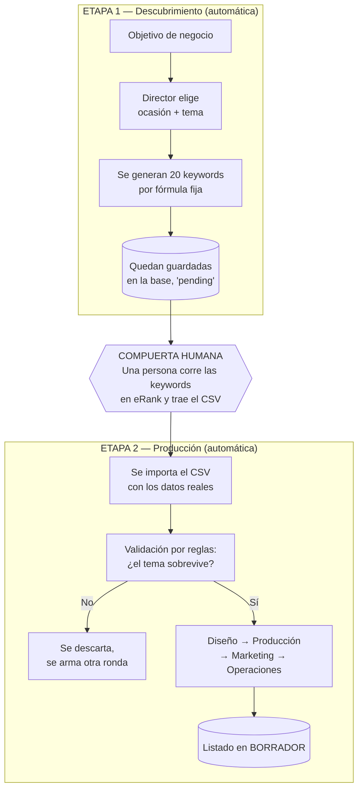
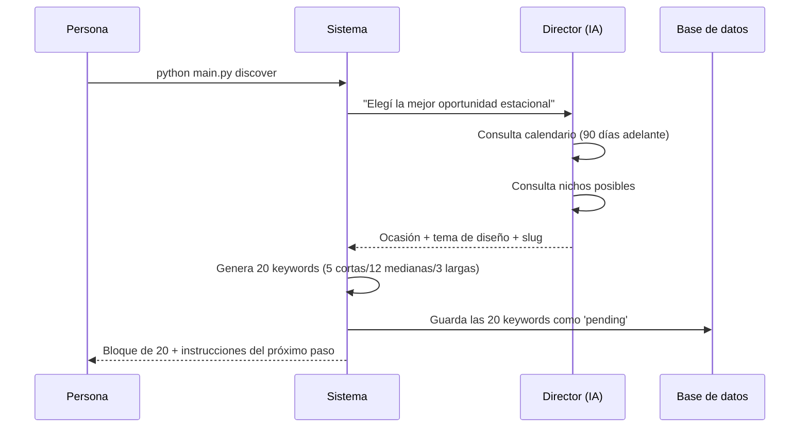
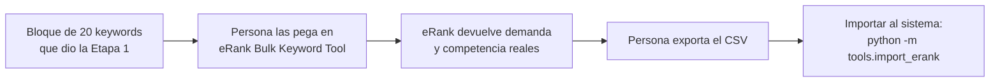
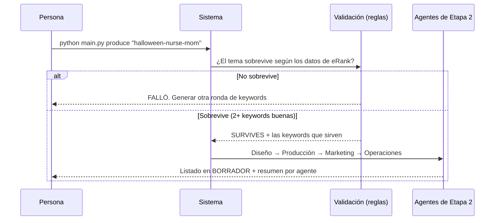

# El flujo del proceso, de principio a fin

El sistema **no corre todo de un tirón**. Está partido en **dos etapas** con una
**intervención humana obligatoria** en el medio. Esta nota explica el recorrido
completo, con diagramas, y por qué el humano tiene que estar ahí.

## Vista general: dos etapas y una compuerta

## Por qué se parte en dos

La razón es simple: **el sistema necesita datos reales de mercado que solo se
consiguen a mano.** eRank (la herramienta que dice cuánta gente busca cada
palabra y cuánta competencia hay) no está conectada automáticamente. Entonces:

- La Etapa 1 prepara las 20 palabras a investigar y se detiene.
- Una persona las corre en eRank, exporta los resultados y los trae.
- La Etapa 2 usa esos datos reales para decidir y producir.

Sin ese dato real, cualquier validación sería una adivinanza. Por eso la
compuerta humana **no es una limitación, es el diseño correcto**.

---

## Etapa 1 — Descubrimiento (en detalle)

**Se lanza con:** `python main.py discover`

**Qué pasa acá:**
1. El **director** elige una ocasión y un tema de diseño, mirando el calendario
   con la anticipación correcta (ver *lead time* abajo).
2. Una **regla fija** genera el bloque de 20 keywords (no lo hace la IA).
3. Las 20 quedan guardadas en la base como "pendientes".
4. El sistema imprime el bloque y te dice exactamente qué hacer después.

> [!info] La regla del "lead time" estacional
> El trabajo estacional va **adelantado**: se investigan temas **90 días antes**
> de la fecha, y se publica **60 días antes**, porque el algoritmo de Etsy tarda
> ~30 días en reconocer y posicionar un listado nuevo. Por eso el director no
> mira el mes actual, sino el que cae ~90 días adelante.

---

## La compuerta humana (paso manual)

Este es el único momento en que el proceso depende de una persona para avanzar.

**Los tres pasos manuales:**
1. Correr las 20 keywords en la herramienta *Bulk Keyword Tool* de eRank.
   (eRank procesa de a 20, con un límite de ~100 por día — por eso el bloque es
   de 20.)
2. Exportar el resultado como archivo CSV.
3. Importarlo al sistema con un comando, indicando el nombre del tema (`niche`).

Al importar, el sistema guarda los datos reales de cada keyword y corre la
validación automáticamente.

---

## Etapa 2 — Producción (en detalle)

**Se lanza con:** `python main.py produce "<nombre-del-tema>"`

**Qué pasa acá:**
1. **Validación por reglas:** clasifica cada keyword y decide si el tema
   sobrevive. La regla de supervivencia: **al menos 2 keywords** tienen que
   pasar el filtro principal. Si no, se corta y hay que armar otra ronda.
2. Si sobrevive, arranca la **cadena de 4 agentes**:
   **Diseño → Producción → Marketing → Operaciones**, cada uno pasándole su
   resultado al siguiente.
3. Termina con el listado en **borrador (DRAFT)**, nunca publicado.

> [!important] Dos frenos humanos, por diseño
> El sistema se detiene ante una persona **dos veces**: (1) para traer los datos
> reales de eRank, y (2) al final, dejando todo en borrador para que alguien
> apruebe antes de publicar y pagar. Nada irreversible ocurre solo.

---

## ¿Y si el tema no sobrevive? (el bucle de reintento)

Si la validación rechaza el tema, el sistema lo dice claramente y no produce
nada. El camino es volver a la Etapa 1, generar una ronda nueva de keywords
(otro ángulo del tema), pasarla por eRank y reintentar. Esto ya se probó y
funciona: en una corrida real, rechazó la primera ronda y aprobó la segunda.

---

Siguiente: [[06 - La salida y cómo leerla]] · Volver al [[MOC - POD Agents]]
