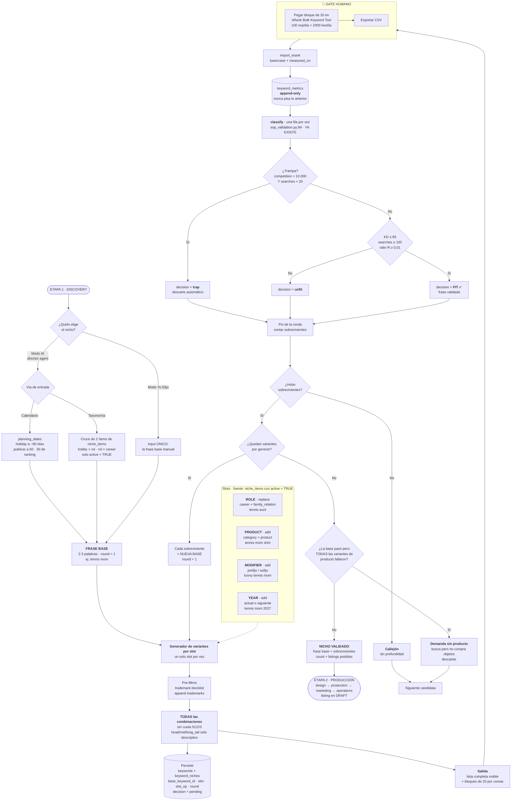
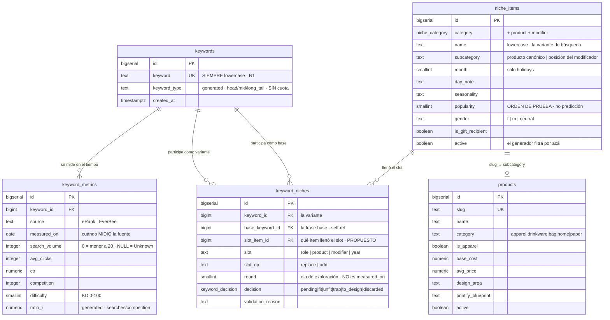

# Diagramas — Proceso y modelo de datos

Dos diagramas del sistema **según las definiciones acordadas**, no según el
código actual. Donde el código todavía no coincide, está marcado.

> [!warning] Estado objetivo, no estado actual
> Estos diagramas reflejan [[Definiciones - Datos, roles y keywords]]. Varias
> piezas todavía no existen en el código: el generador por slots, las tablas
> `keyword_metrics` / `keyword_niches` / `products`, y las categorías `product` y
> `modifier` en `niche_items`.

---

## 1. Proceso completo — de la frase al listing

### Cómo leerlo

- **El loop es el corazón.** `LOOP → GEN` es la iteración: cada frase que pasa el
  filtro se convierte en base de la ronda siguiente. Ahí es donde se acumulan las
  dimensiones (`tennis aunt` de la ronda 2 puede dar `tennis aunt shirt` en la 3).
- **Nada hereda.** Toda flecha que sale de `GEN` vuelve a pasar por el gate y por
  `classify`. Que la base valide no autoriza a ninguna variante.
- **El único paso manual es el gate.** Todo lo demás es determinístico o de
  agente. Ese cuello de botella es humano, no de cupo (D15).
- **`classify` ya está implementado** y no se toca. Todo lo roto está a su
  izquierda, en cómo se generan las frases.

---

## 2. Modelo de datos (ER)

### Las tres decisiones que explican este modelo

**1. `keywords` no tiene métricas.** Es solo la frase canónica. Todas las
mediciones viven en `keyword_metrics`, una fila por `(keyword, fuente, fecha)`.
Reimportar nunca pisa: apila. Es lo que habilita comparar año contra año, algo
que ni eRank ni EverBee dan.

**2. La frase base y sus variantes son la MISMA tabla.** Un nicho no es una
entidad aparte: es una fila de `keywords` que validó. Por eso `keyword_niches`
apunta dos veces a `keywords` — una como variante, otra como base
(`base_keyword_id`). Una frase de la ronda 2 que sobrevive pasa a ser base en la
ronda 3 sin moverse de tabla.

**3. `round` y `measured_on` viven en tablas distintas a propósito.** La ronda es
la ola de exploración y no cambia nunca. `measured_on` es cuándo la fuente midió,
y se agrega una fila nueva cada vez que se re-mide. Confundirlas es lo que hoy
hace que el import pise datos.

### Separación entre taxonomía y comercial

`niche_items` responde **qué medir** (la variante de búsqueda: `tee`, `shirt`,
`graphic tee`). `products` responde **cuánto deja** (costo, precio, área de
diseño, blueprint de Printify). Se vinculan por el slug del producto canónico,
que en `niche_items` vive en `subcategory`.

> [!note] Campo propuesto, todavía no definido
> `keyword_niches.slot_item_id` no está en el documento de definiciones. Lo
> agrego acá porque permite responder *"¿qué roles sobreviven más seguido?"* con
> una consulta, en vez de parsear strings. Si no interesa, se saca sin afectar al
> resto.

---

## Relacionado

- [[Definiciones - Datos, roles y keywords]]
- [[05 - Flujo del proceso]]
- [[MOC - POD Agents]]
